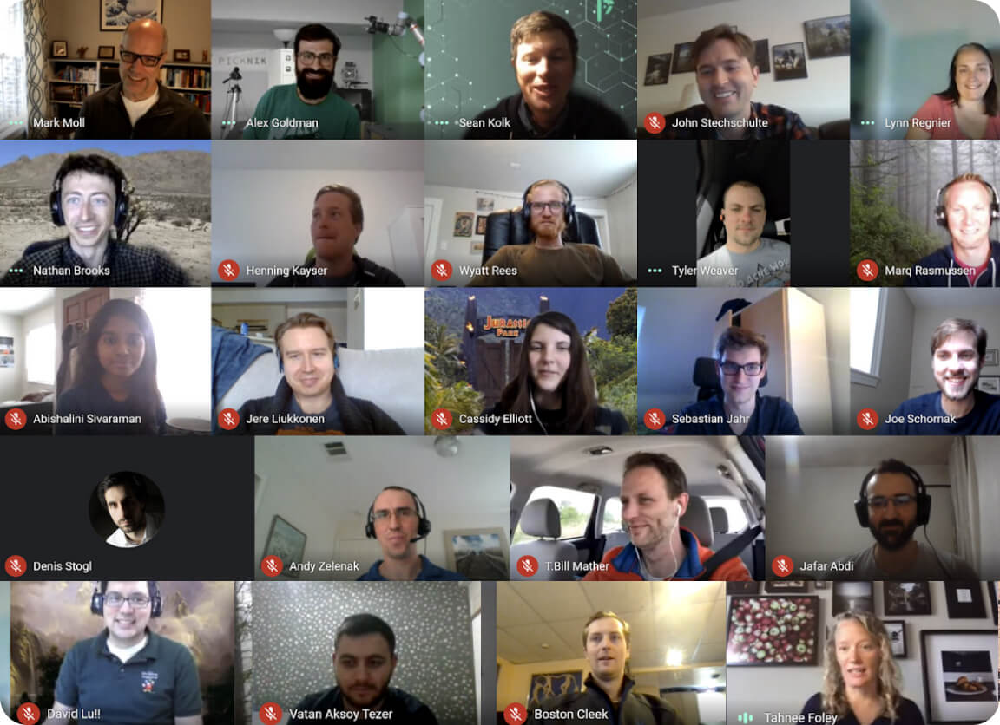

    

        

            

              

                <h1>Work at PickNik</h1>
                Robotics at the Cutting Edge.
                

                  <a class="btn text-uppercase" href="#positions">See open positions</a>
                

              

            

            

              
            

        

    

  

    

      

        

          

            
          

        

        

          

            <h3>We Are Striving for an Amazing Employee Culture</h3>
            
We are building a team of world-class professionals. Work-life balance is a key value for us. We work hard and smart. We believe in flexibility, freedom, internal mentorship, and the ability to work from anywhere. We take the initiative to do it right and believe in continuous improvement.
            

            <a class="careers-card-instagram" target="_blank" href="https://www.instagram.com/picknik_robotics/">
              
              Check out our instagram
            </a>
          

        

      

    

  

  

    

      

        

            <h3 class="block-section__title text-center">Our Values</h3>
        

        

          

            

              <h4 class="mb-0">
                1. Commitment to Open Source
              </h4>
            

            

              

                

                  PickNik was built on open source software and understands how important it is to give back to the community. Each employee has dedicated time set aside to work on exciting robotic open source projects.
                

                 

                  
                

              

            

          

          

            

              <h4 class="mb-0">
                2. Employee Growth & Mentorship
              </h4>
            

            

              

                

                  PickNik was built on open source software and understands how important it is to give back to the community. Each employee has dedicated time set aside to work on exciting robotic open source projects.
                

                

                  
                

              

            

          

          

            

              <h4 class="mb-0">
                3. Collaborative Environment
              </h4>
            

            

              

                

                  PickNik was built on open source software and understands how important it is to give back to the community. Each employee has dedicated time set aside to work on exciting robotic open source projects.
                

                

                  
                

              

            

          

          

            

              <h4 class="mb-0">
                4. Work/Life balance
              </h4>
            

            

              

                

                  PickNik was built on open source software and understands how important it is to give back to the community. Each employee has dedicated time set aside to work on exciting robotic open source projects.
                

                

                  
                

              

            

          

          

            

              <h4 class="mb-0">
                5. Work from Anywhere
              </h4>
            

            

              

                

                  PickNik was built on open source software and understands how important it is to give back to the community. Each employee has dedicated time set aside to work on exciting robotic open source projects.
                

                

                  
                

              

            

          

        

      

    

  

  

      

        

            <h3 class="block-section__title text-center">Where We Work</h3>
        

        <iframe src="https://www.google.com/maps/d/embed?mid=1c_nCP7Fx0HIgAUNQ2w7iAhGT9rKP1-lo" width="100%" height="900px"></iframe>
      

  

  

    

      

        

            <h3 class="block-section__title text-center">Benefits</h3>
        

        

          <ul class="nav nav-tabs" id="myTab" role="tablist">
            <li class="nav-item">
              <a class="nav-link active" id="colorado-tab" data-toggle="tab" href="#colorado" role="tab" aria-controls="colorado" aria-selected="true">Colorado Headquarters</a>
            </li>
            <li class="nav-item">
              <a class="nav-link" id="usbased-tab" data-toggle="tab" href="#usbased" role="tab" aria-controls="usbased" aria-selected="false">US-based Remote</a>
            </li>
            <li class="nav-item">
              <a class="nav-link" id="europe-tab" data-toggle="tab" href="#europe" role="tab" aria-controls="europe" aria-selected="false">Europe & Americas Remote</a>
            </li>
          </ul>
          

            

              

                

                  

                    
                  

                  <h4>Health & 401k</h4>
                

                

                  

                    
                  

                  <h4>Flexible Vacation Policy</h4>
                

                

                  

                    
                  

                  <h4>Education Benefit</h4>
                

                

                  

                    
                  

                  <h4>Free Lunch</h4>
                

                

                  

                    
                  

                  <h4>Dream Workspaces</h4>
                

                

                  

                    
                  

                  <h4>Location</h4>
                

              

            

            

              

                

                  

                    
                  

                  <h4>Great Weather</h4>
                

                

                  

                    
                  

                  <h4>Bus/Bike To Work</h4>
                

                

                  

                    
                  

                  <h4>Work Remote</h4>
                

                

                  

                    
                  

                  <h4>Great Weather</h4>
                

                

                  

                    
                  

                  <h4>Bus/Bike To Work</h4>
                

                

                  

                    
                  

                  <h4>Work Remote</h4>
                

              

            

            

              

                

                  

                    
                  

                  <h4>Great Weather</h4>
                

                

                  

                    
                  

                  <h4>Bus/Bike To Work</h4>
                

                

                  

                    
                  

                  <h4>Work Remote</h4>
                

                

                  

                    
                  

                  <h4>Great Weather</h4>
                

                

                  

                    
                  

                  <h4>Bus/Bike To Work</h4>
                

                

                  

                    
                  

                  <h4>Work Remote</h4>
                

              

            

          

        

        

          

            

              
            

            
            
We’re thrilled to announce that <b>PickNik Robotics</b> has been named to Built In Colorado's
            <a href="https://www.builtincolorado.com/companies/best-small-places-to-work-colorado-2019#picknik-robotics" target="_blank">2019 Best Places to Work Awards!</a> PickNik Robotics won in the Best Small Companies category.

          

        

      

    

  

  

    

    

  

  <h3 class="collapses__title" id="open_positions">Open Positions</h3>
  

