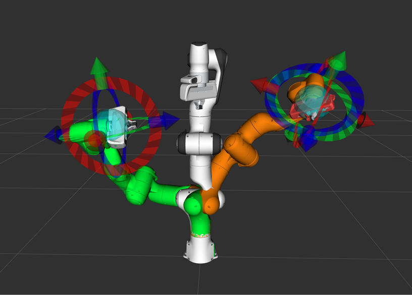

    

        

            

                
                
FRANKA EMIKA ​-​ ​ROBOTS FOR EVERYONE

                

                    
Codesprint to make Panda the flagship robot of the MoveIt! tutorials.

                      
                    
ABOUT:
 MoveIt! is the most popular motion planning framework and one of the top ROS packages across the world, but its documentation and tutorials needed additional cleanup. While this documentation consistently gets minor improvements and contributions from the community, a much larger holistic effort was required to improve the overall information flow and ensure that all major concepts in MoveIt! were included.
                      
                    
CHALLENGE:
 Some MoveIt! users had expressed frustration that the tutorials had not been migrated fully from previous ROS versions, and our example robot was the now defunct PR2 robot. The PR2 does not have full support in ROS Kinetic, causing many issues when using the latest features in MoveIt!.  
                    
SOLUTION:
 In January of 2018, PickNik and Franka Emika partnered to co-sponsor a code sprint to address these issues. This code sprint was a huge success resulting in up-to-date tutorials that use a cutting edge and actively supported robot, the Panda.  
                    
HIGHLIGHTS:
 
                    
&#9633;
 Tested and improved the quality of tutorials for usability 
                    
&#9633;
 Refactored the tutorials to make it significantly easier to use 
                    
&#9633;
 Documented best practices and coding standards to ensure future tutorials maintain high standards 
                    
&#9633;
 Converted all tutorial demos to use a low cost robot with an actively maintained MoveIt! integration

                  
            

        

    

