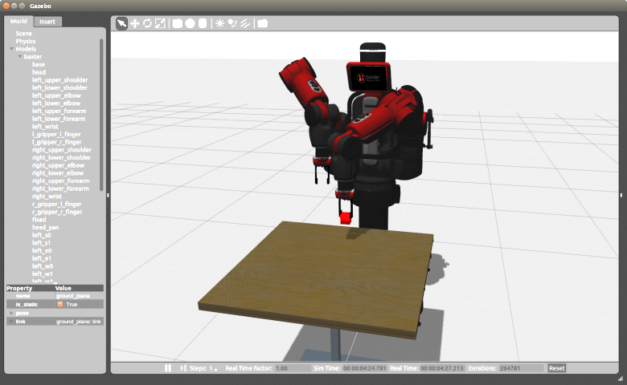

        

            

                

                    
                    
Vicarious​ ​-​ ​AI​ ​for​ ​the​ ​robot​ ​age

                    

                        
Improving​ ​Baxter​ ​robot​ ​to​ ​work​ ​on​ ​the​ ​latest​ ​Gazebo​ ​simulator​ ​and​ ​ROS​ ​release.
  
                        
ABOUT:
 Vicarious​ ​is​ ​developing​ ​artificial​ ​general​ ​intelligence​ ​for​ ​robots.​ ​By​ ​combining​ ​insights​ ​from generative​ ​probabilistic​ ​models​ ​and​ ​systems​ ​neuroscience,​ ​their​ ​architecture​ ​trains
                        ​faster, adapts​ ​more​ ​readily,​ ​and​ ​generalizes​ ​more​ ​broadly​ ​than​ ​AI​ ​approaches​ ​commonly​ ​used​ ​today. Vicarious​ ​hopes​ ​to​ ​bring​ ​human-like​ ​intelligence​ ​to​ ​the​ ​world​ ​of​ ​robots​ ​by​ ​organizing
                        ​around​ ​a set​ ​of​ ​questions​ ​and​ ​themes,​ ​while​ ​using​ ​datasets​ ​that​ ​are​ ​appropriately​ ​designed​ ​to​ ​probe those​ ​questions.
                          
                        
CHALLENGE:
 Vicarious​ ​needed​ ​their​ ​research​ ​to​ ​be​ ​enabled​ ​in​ ​embodied​ ​AI.​ ​They​ ​chose​ ​to​ ​use​ ​an​ ​industry standard​ ​by​ ​selecting​ ​Rethink​ ​Robotics'​ ​Baxter​ ​robot​ ​as​ ​one​ ​of​ ​their
                        ​platforms.​ ​However,​ ​they needed​ ​additional​ ​expertise​ ​to​ ​migrate​ ​Baxter​ ​to​ ​the​ ​latest​ ​version​ ​of​ ​the​ ​Robotic​ ​Operating System​ ​and​ ​the​ ​corresponding​ ​latest​ ​Gazebo​ ​Simulator.  
                        
SOLUTION:
 PickNik​ ​Consulting​ ​was​ ​engaged​ ​to​ ​migrate​ ​Baxter​ ​to​ ​ROS​ ​Kinetic​ ​and​ ​Gazebo​ ​7​ ​on​ ​Ubuntu 16.04.​ ​PickNik​ ​provided​ ​implementation​ ​advice​ ​and​ ​fixed​ ​code​ ​including​ ​upgrading
                        ​various Gazebo​ ​plugins,​ ​creating​ ​custom​ ​Baxter​ ​plugins,​ ​and​ ​finalizing​ ​the​ ​integration​ ​through​ ​extensive testing.  
                        
HIGHLIGHTS:
 
                        
&#9633;
 Vicarious​ ​agreed​ ​to​ ​open​ ​source​ ​the​ ​effort​ ​and​ ​the​ ​results​ ​were​ ​announced​ ​on​ ​the Baxter​ ​mailing​ ​list 
                        
&#9633;
 23​ ​pull​ ​requests​ ​were​ ​created​ ​across​ ​5​ ​Github​ ​repositories 
                        
&#9633;
 Fixes​ ​to​ ​the​ ​upstream​ ​Gazebo​ ​project​ ​were​ ​addressed,​ ​cleaning​ ​up​ ​warnings,​ ​excess console​ ​output,​ ​and​ ​build​ ​errors 
                        
&#9633;
 Load​ ​time​ ​of​ ​the​ ​Baxter​ ​simulator​ ​was​ ​improved​ ​by​ ​35​ ​seconds!

                      
                    
"It​ ​was​ ​the​ ​best​ ​experience​ ​I've​ ​had​ ​working​ ​with​ ​an​ ​external​ ​consultant!"

                    
Dr.​ ​Bhaskara​ ​Marthi

                    
Head​ ​of​ ​Robotics,​ ​Vicarious

                

            

        

    

