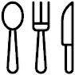

    
    
WORK AT PICKNIK

    

    
Cutting edge. Dynamic. Robotics.
           Tackle some of the toughest problems in a rapidly growing industry. Implement cutting edge robotic algorithms to solve important problems. See your contributions used worldwide in the open source robotics community. We leverage open
        source to deliver custom software solutions to our clients that take advantage of the latest algorithms, research, and techniques.
    

      
    

        

            

                
Applied Robotics Scientist
                EXPAND+
                
                

                

                 
 
                    
Boulder, Denver · Full Time
  
                    
Job Description:
 
                       As an Applied Robotics Scientist at PickNik Consulting you will determine where academic research can be applied to solve our client’s problems and identify opportunities for innovation. You will be developing software
                    applications, optimizing advanced algorithms, and integrating solutions for our clients, internal products, and flagship open source projects. Duties will include developing sophisticated software in a variety of languages and
                    platforms that will be used on robots around the world (and in outer space!).
                       Am I a good fit?
                      
                    
&#9633;
 You love robotics and have a passion for creating the next generation of robot software
                     
                    
&#9633;
 Are excited to be involved in a startup with steady flow of client projects
                     
                    
&#9633;
 Must work efficiently, always be ready to learn, and have great attention to detail
                     
                    
&#9633;
 Desire to contribute to open source projects solving big problems
                     
                    
&#9633;
 Ability to collaborate with teams around the world
                     
                    
&#9633;
 Need to be living in or willing to relocate to Boulder or greater Denver area (or spend significant time there) to foster a great team learning environment
                      
                    
Job Requirements

                      
                    
&#9633;
 Masters or PhD in Robotics, Computer Science, or a related robotics-focused field
                     
                    
&#9633;
 Proven track record of innovation in applying algorithms and advancing robotics
                     
                    
&#9633;
 Strong C++ experience and familiarity with at least one scripting language, preferably Matlab or Python
                     
                    
&#9633;
 Theoretical understanding of motion planning, inverse kinematics, control systems, graph theory, and/or simulation
                     
                    
&#9633;
 Demonstrated ability, either through previous projects, advanced education/research, and/or knowledge of the robotics field
                     
                    
&#9633;
 Experience with ROS or similar robotics middleware
                      
                    
Some preferred skills/experience:

                      
                    
&#9633;
 MoveIt!, Gazebo, OpenRave, or other robotic libraries are advantageous
                     
                    
&#9633;
 Common open source libraries and tools such as Eigen and Boost
                      
                    
Benefits

                      
                    
&#9633;
 Live in beautiful Boulder, CO with easy access to renowned skiing, biking, climbing, and ranked #2 by US News and Report Best Places to Live
                     
                    
&#9633;
 Enjoy a relaxed work environment with a generous vacation policy
                     
                    
&#9633;
 Work a flexible schedule including working remotely when you need to
                     
                    
&#9633;
 Health Reimbursement Account (HRA)
                      
                    
Skill Keywords: 

                       Software Engineering, Python, C++, Control Systems, Robotics, Simulations, Motion Planning, Mobile Robotics, Robot Operating System (ROS), Gazebo, Robot motion planning, Moveit!, Inverse Kinematics
                       So you wanna join, what do you need to do?
                       Submit your resume to <a href="mailto:jobs@picknik.ai">jobs@picknik.ai</a> and highlight relevant experience.
                     
                     
                    
APPLY NOW

                

            

        

    

    

        

            

                
Senior Software Engineer - Robotics
                EXPAND+
                
                

                

                 

                    
Boulder, Denver · Full Time
  
                    
Job Description:
 
                       As a Senior Robotics Software Engineer at PickNik Consulting you’ll be developing software applications, optimizing advanced algorithms, and integrating solutions for our clients, internal products, and flagship open source
                    projects. Duties will include developing software in a variety of languages and platforms that will be used on robots around the world (and in outer space!). You’ll need to readily make decisions relating to framework design and
                    implementation.
                       Am I a good fit?
                      
                    
&#9633;
 You love robotics and have a passion for creating the next generation of robot software
                     
                    
&#9633;
 Are excited to be involved in a startup with steady flow of client projects
                     
                    
&#9633;
 Must work efficiently, always be ready to learn, and have great attention to detail
                     
                    
&#9633;
 Desire to contribute to open source projects solving big problems
                     
                    
&#9633;
 Ability to collaborate with teams around the world
                     
                    
&#9633;
 Need to be living in or willing to relocate to Boulder or greater Denver area (or spend significant time there) to foster a great team learning environment
                      
                    
Job Requirements

                      
                    
&#9633;
 Degree(s) in Computer Science, Robotics, Engineering, or a related field and/or equivalent industry experience. Advanced degrees are a plus.
                     
                    
&#9633;
 Extensive knowledge of C++11 or newer.
                     
                    
&#9633;
 Skilled with at least one scripting language such as Python or Matlab.
                     
                    
&#9633;
 Extensive knowledge of software development in Linux.
                     
                    
&#9633;
 Experience with full life-cycle library and application development, Git version control, software testing, and continuous integration.
                     
                    
&#9633;
 Experience with communication middleware
                      
                    
Some preferred skills/experience:

                      
                    
&#9633;
 Common open source libraries and tools such as Eigen, OGRE, Qt, CMake, Bazel, and Protobufs.
                     
                    
&#9633;
 ROS, MoveIt!, Gazebo, OpenRave, or other robotic libraries are advantageous.
                     
                    
&#9633;
 General understanding of motion planning, inverse kinematics, control systems, graph theory, and/or simulation.
                     
                    
&#9633;
 Demonstrated ability, either through previous projects, advanced education/research, and/or knowledge of the robotics field.
                     
                     
                    
Benefits

                      
                    
&#9633;
 Live in beautiful Boulder, CO with easy access to renowned skiing, biking, climbing, and ranked #2 by US News and Report Best Places to Live
                     
                    
&#9633;
 Enjoy a relaxed work environment with a generous vacation policy
                     
                    
&#9633;
 Work a flexible schedule including working remotely when you need to
                     
                    
&#9633;
 Health Reimbursement Account (HRA)
                      
                    
Skill Keywords: 

                       Software Engineering, Python, C++, Control Systems, Robotics, Simulations, Motion Planning, Mobile Robotics, Robot Operating System (ROS), Gazebo, Robot motion planning, Moveit!, Inverse Kinematics
                       So you wanna join, what do you need to do?
                       Submit your resume to <a href="mailto:jobs@picknik.ai">jobs@picknik.ai</a> and highlight relevant experience.
                      
                    
APPLY NOW

                

            

        

    

    

        

            

                
Office Linebacker
                EXPAND+
                
                

                

                    
Boulder, Denver · Full Time
  
                    
Job Description:

                       Tackle some of the toughest problems in an office setting.
                      
                    

                        <iframe width="560" height="315" src="https://www.youtube.com/embed/7aZMS6st3D4?rel=0&amp;showinfo=0" frameborder="0" allow="autoplay; encrypted-media" allowfullscreen></iframe>
                    

                      Submit your resume and highlight reel to <a href="mailto:jobs@picknik.ai">jobs@picknik.ai</a>.
                

            

        

    

    

        

            
        

        

            

                
                
We Value Our Team

                

                
We hire world-class professionals. Life balance is a key value for us. We work hard and smart; long hours alone just wear people out.
                

            

        

    

    

        

            Perks
        

        

        

            

                
            

            

                
            

            

                
            

        

        

            

                

                Dream Workspaces
                

                 
                

                Standing desks, multiple monitors... whatever you need to be happy at work.
                

            

            

                

                Free Lunch
                

                 
                

                We have weekly team lunches and plenty of healthy snacks.
                

            

            

                

                Bus/Bike To Work
                

                 
                

                Our office is next to the main bus station and many bike paths.
                

            

        

        

            

                
            

            

                
            

            

                
            

        

        

            

                

                Flexible Vacation Policy
                

                 
                

                We have a flexible vacation policy that lets you take time off or work from home whenever you need it.
                

            

            

                

                Great Climate
                

                 
                

                Boulder's 245 days of sun a year makes our 4 seasons wonderfully mild.
                

            

            

                

                Location
                

                 
                

                Boulder's prime location in the foothills of the Rocky Mountains gives you easy access to all your favorite outdoor activities.
                

            

        

    

