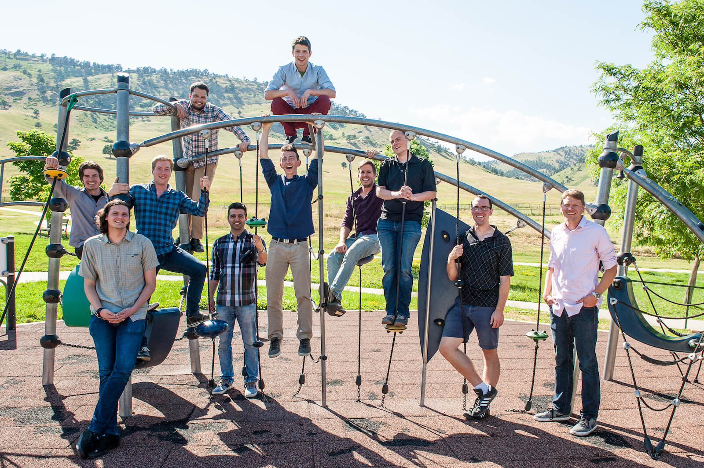

    

        

            

                <h1 class="jobs-section-main-title">Work at Picknik</h1>
                Cutting edge. Dynamic. Robotics.
            

            

                

                    Tackle some of the toughest problems in a rapidly growing industry. Implement cutting edge robotic algorithms to solve important problems. See your contributions used worldwide in the open source robotics community. We leverage open source to deliver custom software solutions to our clients that take advantage of the latest algorithms, research, and techniques.
                

            

        

    

    

        

            

                

                    

                        
                    

                

                

                    

                        <h3>We Value Our Team</h3>
                        
We are building a team of world-class professionals. Work-life balance is a key value for us. We work hard and smart. We believe in flexibility, freedom, internal mentorship, and the ability to work from anywhere. We take the initiative to do it right and believe in continuous improvement.
                        

                    

                

            

        

        

            

                <h3 class="block-section__title">Perks</h3>
            

            

                

                    

                        

                            

                                
                            

                            <h5>Dream Workspaces</h5>
                            Enjoy standing desks, multiple monitors, toy dinosaurs... whatever you need to be happy at work.
                        

                    

                    

                        

                            

                                
                            

                            <h5>Free Lunch</h5>
                            We have weekly team lunches and plenty of healthy snacks.
                        

                    

                    

                        

                            

                                
                            

                            <h5>Bus/Bike To Work</h5>
                            Our office is next to the downtown bus station (pass included!) and many bike paths.
                        

                    

                    

                        

                            

                                
                            

                            <h5>Flexible Vacation Policy</h5>
                            We're flexible with time off and working remotely.
                        

                    

                    

                        

                            

                                
                            

                            <h5>Health & 401k</h5>
                            Boulder is the <a href="https://www.businessinsider.com/the-25-healthiest-cities-in-america-2016-7">Healthiest City In America</a> but we still offer all the standard benefits, like health + dental insurance and a 401k plan.
                        

                    

                    

                        

                            

                                
                            

                            <h5>Location</h5>
                            Boulder's location in the foothills of the Rockies gives you easy access to all your favorite outdoor activities.
                        

                    

                

            

        

    

    

        <h3 class="collapses__title">Open Positions</h3>
        

        
        
        

        

    

