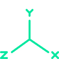
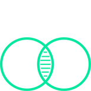

    

    

        

            
            
Our Services

            

            
At PickNik, we care about the quality of your robotic system. We listen to your needs and tailor our services to ensure smooth delivery of highly-quality solutions.   Read on to learn more.
            

        

    

    

    

        

            
            
MOTION PLANNING

            

            

                

                    
IDENTIFICATION OF THE BEST PATH PLANNING APPROACH 

                    

                        
□
 Consulting services to use the best algorithm for a given application and problem type
                         
                        
□
 Benchmarking competing approaches for analytical analysis
                         
                        
□
 Implementation of novel algorithms and approaches
                         
                        
□
 Reviewing current literature and academic surveys for cutting edge solutions
                         
                        
□
 Technology readiness level analysis and reporting
                    

                     
                     
                

                

                    
PROBABILISTIC/SAMPLING BASED METHODS 

                    

                        
□
 Consulting and development of the Open Motion Planning Library (OMPL)
                         
                        
□
 Multi-query planners including PRM, LazyPRM, PRM*
                         
                        
□
 Single-query planners including RRT, RRTConnect, RRT*, T-RRT, and LazyRRT
                         
                        
□
 Asymptotically near-optimal planners including SPARS, SPARS2
                         
                        
□
 Projection-based methods including EST, KPIECE, AtlasRRT
                    

                     
                     
                

            

            

                

                    
OTHER MOTION PLANNING METHODS 

                    

                        
□
 Search Based Planning Library (SBPL)
                         
                        
□
 Stochastic Trajectory Optimization for Motion Planning (STOMP)
                         
                        
□
 Covariant Hamiltonian Optimization for Motion Planning (CHOMP)
                         
                        
□
 Dynamic Motion Primitives
                         
                    

                     
                     
                

                

                    
EXPERIENCE-BASED MOTION PLANNING 

                    

                        
□
 Recall and repair of past plans for faster future planning
                         
                        
□
 More deterministic results
                         
                        
□
 Experts in Thunder, Bolt, and Lightning algorithms
                         
                    

                

            

            

        

    

    

        

            
            
ADVANCED INVERSE KINEMATICS

            

            

                

                    
ANALYTIC SOLUTIONS

                    

                        
□
 Experts in both computationally and manually generated solutions
                         
                        
□
 Closed-form analytic solutions return complete solutions in microseconds
                         
                        
□
 6 degrees of freedom (DOF) and less solvers
                         
                        
□
 Consultation on mechanical design of robots
                         
                    

                     
                     
                

                

                    
ITERATIVE METHODS

                    

                        
□
 Advice in choosing the best inverse kinematics solvers for your application
                         
                        
□
 Experts with off-the-shelf open source KDL, LMA, and Trac_IK solvers
                         
                        
□
 Customize inverse Jacobian methods, gradient projection method, heuristic method, etc.
                         
                        
□
 Integrate complex constraints and behaviors in the null space
                         
                    

                     
                     
                

            

            

                

                    
MULTIPLE ARMS

                    

                        
□
 Implementing IK solvers for arbitrary robot configurations with multiple arms and legs
                         
                        
□
 Support for overlapping (shared) joints such as torsos
                         
                        
□
 Inverse kinematic solvers that satisfy multiple constraint functions such as stack of tasks and particle swarm optimization
                         
                        
□
 Motion planning with underconstrained waypoints that iteratively run IK
                         
                    

                

            

            

        

    

    

        

            
            
REAL-TIME CONTROL

            

            

                

                    
CONTROL FRAMEWORKS

                    

                        
□
 Integration and customization of the ROS Control Framework
                         
                        
□
 Creation of custom controllers including position, velocity, and force controllers
                         
                        
□
 Integration of the OROCOS control framework
                         
                    

                     
                     
                

                

                    
REACTIVE PLANNING

                    

                        
□
 Fast planners that are able to react and adjust to a changing environment
                         
                        
□
 Dual mode Cartesian and free-space planning algorithms for wide range of applications
                         
                        
□
 System wide performance benchmarking
                         
                    

                

            

            

        

    

    

        

            
            
COLLISION AVOIDANCE

            

            

                

                    
PLANNING AROUND STATIC AND DYNAMIC OBSTACLES

                    

                        
□
 Modeling of static and dynamic environments as “Planning Scenes”
                         
                        
□
 Collision aware planning using virtual maps of the environment
                         
                        
□
 Avoidance of local minimum around obstacles while planning
                         
                        
□
 Experts with relevant libraries including the Flexible Collision Library (FCL), Octomaps, and the Point Cloud Library (PCL)
                         
                    

                    

                    

                

            

            

        

    

    

        

            
            
CUSTOM ROS INTEGRATION

            

            

                

                    
ROS FRAMEWORK DESIGN

                    

                        
□
 Custom ROS development for your application / hardware
                         
                        
□
 Consulting on best practices for standard ROS paradigms
                         
                        
□
 Training for internal development teams new to ROS
                         
                        
□
 Historical insights into design decisions and ongoing ROS shortcomings
                         
                    

                     
                     
                

                

                    
ROS2 DDS MIDDLEWARE CONVERSION

                    

                        
□
 Assistance with converting legacy ROS packages to ROS2
                         
                        
□
 Expertise in ROS2 advantages and release status
                         
                    

                     
                     
                

            

            

                

                    
HIGH-QUALITY ROS PACKAGES / STACKS

                    

                        
□
 Fully ROS compliant code repository setup and catkinization
                         
                        
□
 Documented, tested, and code-reviewed deliverables
                         
                        
□
 Continuous integration scripts and integration testing
                         
                        
□
 Nvidia GPU-enabled Docker containers for multi-platform support
                         
                        
□
 ROS C++ style guidelines, roslint, and catkin lint enforcement 

                

                

                

            

            

        

    

    

        

            
            
2D NAVIGATION

            

            

                

                    
MOBILE BASE NAVIGATION STACK

                    

                        
□
 ROS navigation stack integration, customization, and deployment
                         
                        
□
 Mobile base path and trajectory planning
                         
                        
□
 OpenSlam's Gmapping, Google Cartographer algorithms for SLAM-based tracking
                         
                        
□
 ROS-Control framework for switching between simulated and real-world environments
                         
                        
□
 Gazebo-based simulation of mobile navigation

                

                

                

            

            

        

    

    

        

            
            
VIRTUAL REALITY

            

            

                

                    
IMMERSIVE ROBOT VISUALIZATIONS 

                    

                        
□
 Iterate faster on hardware by testing new designs virtually before physical prototyping
                         
                        
□
 Deploy teleop environments with a high degree of situational awareness
                         
                        
□
 Use ROS Rviz with off-the-shelf 3D headsets like the HTC Vive and Occulus Rift
                         
                        
□
 Evaluate and plan your collaborative robot integration strategy in virtual reality
                         
                        
□
 Run Unity3D on Windows or Linux 

                

                

                

            

            

        

    

    

        

            
            
ROBOT MODELLING

            

            

                

                    
ASSEMBLY MODELLING

                    

                        
□
 Setup​ ​Solidworks​ ​assembly​ ​files​ ​to​ ​have​ ​proper​ ​mechanical​ ​mates​ ​and​ ​joint​ ​limits
                         
                        
□
 Setup​ ​coordinate​ ​systems​ ​for​ ​DH​ ​parameterization
                         
                        
□
 Create​ ​Interface​ ​Control​ ​documents​ ​for​ ​consistent​ ​representation​ ​of​ ​the​ ​robot's​ ​kinematics
                    

                     
                     
                

                

                    
URDF GENERATION

                    

                        
□
 Convert​ ​CAD​ ​files​ ​to​ ​compliant​ ​URDF​ ​specifications
                         
                        
□
 Verification​ ​of​ ​joint​ ​limits​ ​and​ ​appearance​ ​in​ ​Rviz
                         
                        
□
 Integrate​ ​inertial​ ​properties​ ​for​ ​simulation​ ​in​ ​Gazebo
                         
                        
□
 Integrate​ ​actuator​ ​and​ ​controller​ ​properties​ ​for​ ​ROS​ ​Control
                    

                     
                     
                

            

            

                

                    
CAD PACKAGES

                    
We​ ​are​ ​currently​ ​compatible​ ​with​ ​the​ ​following​ ​CAD​ ​packages:

                    

                        
□
 Solidworks​ ​2017​ ​/​ ​2018
                         
                        
□
 OnShape
                    

                

                

                

            

            

        

    

    

        

            
            
WORKSPACE ANALYSIS

            

            

                

                    
REACHABILITY & USABILITY STUDIES

                    

                        
□
 Analysis of robot base placement with respect to workspace
                         
                        
□
 Determine starting poses for various tasks
                         
                        
□
 Reachability Maps
                         
                        
□
 Optimal arm placement
                         
                         
                    

                

            

            

        

    

    

        

            
            
MACHINE LEARNING

            

            

                

                    
IDENTIFICATION OF BEST MACHINE LEARNING APPROACH

                    

                        
□
 Consulting on best machine learning approaches to use for various applications
                         
                        
□
 Experience with wide variety of machine learning algorithms for a wide variety of tasks
                         
                        
□
 Implementation of novel algorithms and approaches
                         
                        
□
 Technical road-mapping
                         
                         
                    

                

                

                    
PERCEPTION PIPELINES

                    

                        
□
 Neural Network based perception systems
                         
                        
□
 SVD, Random Forests, Naive Bayes, etc...
                         
                        
□
 Sophisticated algorithm analysis
                         
                        
□
 Structured and unstructured learning
                         
                    

                

            

            

                

                    
DATA PIPELINE MANAGEMENT

                    

                        
□
 Dataset Generation and Labeling
                         
                        
□
 Feature Extraction and Data Munging
                         
                        
□
 ETL Pipelines using AWS and other cloud based services
                         
                    

                

                

                

            

              

        

    

    

        

            
            
ROS 2 INTEGRATION

            

            

                

                    
WE CAN CONVERT YOUR ROS1 CODE WITH EASE

                    

                        
□
 Next generation of ROS development                         
                        
□
 Migration to DDS. Colcon, & Managed Nodes
                         
                        
□
 Expanded industrial-grade features
                         
                        
□
 Future-proof your work
                         
                         
                    

                

            

        

    

    

        

            
            
CLOUD INTEGRATION

            

            

                

                    
AMAZON ROBOMAKER AND GOOGLE CLOUD INTEGRATION

                    

                        
□
 Easily develop and deploy robotic fleets at scale  
                        
□
 Remote monitoring, logging, and control
                         
                        
□
 Improved cloud-based visual and speech recognition
                         
                        
□
 Simulation service to accelerate application testing
                         
                         
                    

                

            

        

    

    

        

            
            
WEB-BASED ROBOT CONTROL

            

            

                

                    
MODERN PLATFORM-AGNOSTIC FRONT-ENDS

                    

                        
□
 Develop React and Python apps for your robotic system
                         
                        
□
 Leverage latest web standards and technologies
                         
                        
□
 Remote monitoring via video feeds and full situational awareness
                         
                        
□
 Connecting JavaScript to ROS via rosbridge
                         
                         
                    

                

            
          
        

    

