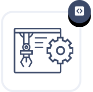
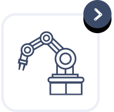

    

        

            

                <h1 class="services-section-main-title">Services</h1>
                Plan. Build. Support.
            

            

                

                    At PickNik, we care about the quality of your robotic application.
                    We listen to your needs and tailor our services to ensure smooth delivery of high-quality solutions. We are flexible and customize
                    our engagement to suit your unique requirements. Our most popular three services are as follows:
                

            

        

    

    

        

            

                

                    
                

                <h3>Robotics   Consulting</h3>
                
Leverage our team of expert roboticists to answer your toughest problems. Our consulting engagements typically involve a weekly standing meeting to check in on your team's progress and advise on common pitfalls. We can provide onsite support and training, as well as remote consulting through video calls with email follow-ups.
                

                <a href="/services/robotics-consulting" class="btn">discover more</a>
            

            

                

                    
                

                <h3>Custom  Development</h3>
                
Let our team of expert ROS and MoveIt engineers supercharge your development. Whether we work embedded within your development team or remotely developing an end to end solution to fit your needs, we always deliver the highest quality work and provide exceptional documentation.
                

                <a href="/services/custom-development" class="btn">discover more</a>
            

            

                

                    
                

                <h3>MoveIt  Support</h3>
                
PickNik is the organization behind the MoveIt Motion Planning Framework. Our ongoing support of the MoveIt project means that we are uniquely qualified to assist your integration and customization of MoveIt. From high level architecture decisions, to resolving common issues, this low-hassle engagement will de-risk your robotics projects and provide enormous value to your organization.
                

                <a href="/services/moveit" class="btn">discover more</a>
            

        

    

