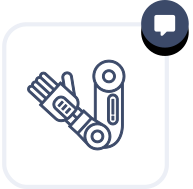

    

        

            

                <h1 class="services-section-main-title">Services</h1>
                Plan. Build. Support.
            

            

                

                    At PickNik, we care about the quality of your robotic application. We listen to your needs and tailor our approach to ensure smooth delivery of highly-quality solutions. Our most popular three services are as follows:
                

            

        

    

    

        

            

                <a href="/services/feasibility-study/">
                    

                        
                    

                    <h3>Feasibility  Study</h3>
                </a>
                

                Before launching a large project with a new client, we have found it beneficial to conduct a small fixed-price consulting engagement that generates an in-depth Feasibility Study report. This includes a technical analysis, risk assessment, development of milestones, and architecture diagrams. The feasibility study allows both parties to test the waters and fully understand each other.
                

                <a href="/services/feasibility-study/" class="btn">discover more</a>
            

            

                <a href="/services/custom-development">
                    

                        
                    

                    <h3>Strategic  Development</h3>
                </a>
                
Let our team of expert roboticists and software engineers supercharge your research & development. Whether we work embedded within your development team or remotely developing an end to end solution to fit your needs, we always deliver the highest quality work and provide exceptional documentation. From our experience, getting hands on with the software provides the most insights and value to you.
                

                <a href="/services/custom-development" class="btn">discover more</a>
            

            

                <a href="/services/robotics-consulting">
                    

                        
                    

                    <h3>Ongoing Robotics Support</h3>
                </a>
                
Leverage our team of expert roboticists to answer your toughest problems. Our robotics consulting involves daily asyncronous communication with weekly check-in calls to support your project's goals and advise on common pitfalls. We provide remote <a href="https://picknik.ai/ros/">ROS consulting</a> through video calls, shared Slack channels, and email follow-ups as well as onsite training.
                

                <a href="/services/robotics-consulting" class="btn">discover more</a>
            

        

    

    

        <h3 class="collapses__title">Areas of Expertise</h3>
        

            

                

                    <h5 class="mb-0">
                        
                        Robot Arm Planning
                            

                                <svg width="16px" height="16px" viewBox="0 0 24 24" version="1.1" xmlns="http://www.w3.org/2000/svg" xmlns:xlink="http://www.w3.org/1999/xlink"><g  stroke="none" stroke-width="1" fill="none" fill-rule="evenodd"><polygon fill="#3C4A69" points="22 14 14 14 14 22 11 22 11 14 3 14 3 11 11 11 11 3 14 3 14 11 22 11"></polygon></g></svg>
                            

                        
                    </h5>
                

                

                    

                        

                            <strong>
                                Identification of the best path planning approach
                            </strong>
                        

                        <ul>
                            <li>
                                Motion planning consulting for leveraging the ideal algorithm for a given application and problem type
                            </li>
                            <li>
                                Benchmarking competing planning approaches for analytical analysis
                            </li>
                            <li>
                                Implementation of novel path planning algorithms and approaches
                            </li>
                            <li>
                                Reviewing current robotics literature and academic surveys for cutting edge solutions
                            </li>
                            <li>
                                Technology readiness level analysis and reporting for motion planning
                            </li>
                        </ul>
                        

                            <strong>
                                Probabilistic/sampling based methods
                            </strong>
                        

                        <ul>
                            <li>
                                MoveIt consulting and development for the popular <a href="https://picknik.ai/ros/">ROS framework</a>
                            </li>
                            <li>
                                Consulting and development of the Open Motion Planning Library (OMPL)
                            </li>
                            <li>
                                Multi-query planners including PRM, LazyPRM, PRM*
                            </li>
                            <li>
                                Single-query planners including RRT, RRTConnect, RRT*, T-RRT, and LazyRRT
                            </li>
                            <li>
                                Asymptotically near-optimal planners including SPARS, SPARS2
                            </li>
                            <li>
                                Projection-based methods including EST, KPIECE, AtlasRRT
                            </li>
                        </ul>
                        

                            <strong>
                                Other motion planning methods
                            </strong>
                        

                        <ul>
                            <li>
                                Trajectory Optimization (TrajOpt)
                            </li>
                            <li>
                                Search Based Planning Library (SBPL)
                            </li>
                            <li>
                                Stochastic Trajectory Optimization for Motion Planning (STOMP)
                            </li>
                            <li>
                                Covariant Hamiltonian Optimization for Motion Planning (CHOMP)
                            </li>
                            <li>
                                Dynamic Motion Primitives
                            </li>
                        </ul>
                        

                            <strong>
                                Experience-based motion planning
                            </strong>
                        

                        <ul>
                            <li>
                                Recall and repair of past plans for faster future planning
                            </li>
                            <li>
                                More deterministic results
                            </li>
                            <li>
                                Experts in Thunder and Lightning algorithms as well as the Bolt framework
                            </li>
                        </ul>
                    

                

            

            

                

                    <h5 class="mb-0">
                        
                        Collision Avoidance
                            

                                <svg width="16px" height="16px" viewBox="0 0 24 24" version="1.1" xmlns="http://www.w3.org/2000/svg" xmlns:xlink="http://www.w3.org/1999/xlink"><g  stroke="none" stroke-width="1" fill="none" fill-rule="evenodd"><polygon fill="#3C4A69" points="22 14 14 14 14 22 11 22 11 14 3 14 3 11 11 11 11 3 14 3 14 11 22 11"></polygon></g></svg>
                            

                        
                    </h5>
                

                

                    

                        

                            <strong>
                                Planning around static and dynamic obstacles
                            </strong>
                        

                        <ul>
                            <li>
                                Modeling of static and dynamic environments as “Planning Scenes”
                            </li>
                            <li>
                                Collision aware planning using virtual maps of the environment
                            </li>
                            <li>
                                Continuous collision checking approaches
                            </li>
                            <li>
                                Avoidance of local minimum around obstacles while planning
                            </li>
                            <li>
                                Experts with relevant libraries including the Flexible Collision Library (FCL), Bullet, Octomaps, and the Point Cloud Library (PCL)
                            </li>
                        </ul>
                    

                

            

            

                

                    <h5 class="mb-0">
                        
                        Inverse Kinematics
                            

                                <svg width="16px" height="16px" viewBox="0 0 24 24" version="1.1" xmlns="http://www.w3.org/2000/svg" xmlns:xlink="http://www.w3.org/1999/xlink"><g  stroke="none" stroke-width="1" fill="none" fill-rule="evenodd"><polygon fill="#3C4A69" points="22 14 14 14 14 22 11 22 11 14 3 14 3 11 11 11 11 3 14 3 14 11 22 11"></polygon></g></svg>
                            

                        
                    </h5>
                

                

                    

                        

                            <strong>
                                Analytic solutions
                            </strong>
                        

                        <ul>
                            <li>
                                Experts in both computationally and manually generated solutions
                            </li>
                            <li>
                                Closed-form analytic solutions return complete solutions in microseconds
                            </li>
                            <li>
                                6 degrees of freedom (DOF) and less solvers
                            </li>
                            <li>
                                Consultation on mechanical design of robots
                            </li>
                        </ul>
                        

                            <strong>
                                Iterative methods
                            </strong>
                        

                        <ul>
                            <li>
                                7 degrees of freedom or more solvers
                            </li>
                            <li>
                                Advice in choosing the best inverse kinematics solvers for your application
                            </li>
                            <li>
                                Experts with off-the-shelf open source KDL, LMA, and TracIK solvers
                            </li>
                            <li>
                                Customize inverse Jacobian methods, gradient projection method, heuristic method, etc.
                            </li>
                            <li>
                                Integrate complex constraints and behaviors in the null space
                            </li>
                        </ul>
                        

                            <strong>
                                Multiple arms
                            </strong>
                        

                        <ul>
                            <li>
                                Implementing IK solvers for arbitrary robot configurations with multiple arms and legs
                            </li>
                            <li>
                                Support for overlapping (shared) joints such as torsos
                            </li>
                            <li>
                                Inverse kinematic solvers that satisfy multiple constraint functions such as stack of tasks and particle swarm optimization
                            </li>
                            <li>
                                Motion planning with underconstrained waypoints that iteratively run IK
                            </li>
                        </ul>
                    

                

            

            

                

                    <h5 class="mb-0">
                        
                        Realtime Motion Control
                            

                                <svg width="16px" height="16px" viewBox="0 0 24 24" version="1.1" xmlns="http://www.w3.org/2000/svg" xmlns:xlink="http://www.w3.org/1999/xlink"><g  stroke="none" stroke-width="1" fill="none" fill-rule="evenodd"><polygon fill="#3C4A69" points="22 14 14 14 14 22 11 22 11 14 3 14 3 11 11 11 11 3 14 3 14 11 22 11"></polygon></g></svg>
                            

                        
                    </h5>
                

                

                    

                        

                            <strong>
                                Control frameworks
                            </strong>
                        

                        <ul>
                            <li>
                                Integration and customization of the ROS Control Framework
                            </li>
                            <li>
                                Creation of custom controllers including position, velocity, and force controllers
                            </li>
                            <li>
                                Integration of the OROCOS control framework
                            </li>
                        </ul>
                        

                            <strong>
                                Reactive planning
                            </strong>
                        

                        <ul>
                            <li>
                                Fast planners that are able to react and adjust to a changing environment
                            </li>
                            <li>
                                Dual mode Cartesian and free-space planning algorithms for a wide range of applications
                            </li>
                            <li>
                                System wide performance benchmarking
                            </li>
                        </ul>
                    

                

            

            

                

                    <h5 class="mb-0">
                        
                        Grasping and Manipulation
                            

                                <svg width="16px" height="16px" viewBox="0 0 24 24" version="1.1" xmlns="http://www.w3.org/2000/svg" xmlns:xlink="http://www.w3.org/1999/xlink"><g  stroke="none" stroke-width="1" fill="none" fill-rule="evenodd"><polygon fill="#3C4A69" points="22 14 14 14 14 22 11 22 11 14 3 14 3 11 11 11 11 3 14 3 14 11 22 11"></polygon></g></svg>
                            

                        
                    </h5>
                

                

                    

                        

                            <strong>
                                Grasping
                            </strong>
                        

                        <ul>
                            <li>
                                Libraries for generating target grasp poses including MoveIt Grasps and GDP Grasping
                            </li>
                            <li>
                                Neural networks for converting camera data to grasp poses
                            </li>
                            <li>
                                Pre-Grasp, Grasp, and Post-Grasp evaluation with heuristic pruning
                            </li>
                            <li>
                                Overall manipulation pipeline development
                            </li>
                        </ul>
                    

                

            

            

                

                    <h5 class="mb-0">
                        
                        Perception and Vision
                            

                                <svg width="16px" height="16px" viewBox="0 0 24 24" version="1.1" xmlns="http://www.w3.org/2000/svg" xmlns:xlink="http://www.w3.org/1999/xlink"><g  stroke="none" stroke-width="1" fill="none" fill-rule="evenodd"><polygon fill="#3C4A69" points="22 14 14 14 14 22 11 22 11 14 3 14 3 11 11 11 11 3 14 3 14 11 22 11"></polygon></g></svg>
                            

                        
                    </h5>
                

                

                    

                        

                            <strong>
                                3D Perception
                            </strong>
                        

                        <ul>
                            <li>
                                PCL Consulting and integration for the Point Cloud Library
                            </li>
                            <li>
                                Experience with all kinds of camera hardware (monocular, stereo, depth camera, LIDAR)
                            </li>
                            <li>
                                Object detection and image segmentation using deep neural networks
                            </li>
                            <li>
                                Simultaneous Localization and Mapping (SLAM)
                            </li>
                            <li>
                                Point cloud segmentation, point cloud alignment
                            </li>
                            <li>
                                Probabilistic models for visual perception
                            </li>
                            <li>
                                Visual-inertial odometry
                            </li>
                            <li>
                                Experience with Intel Realsense, Microsoft Kinect 2, and Orbbec AstraPro
                            </li>
                          <li>
                            Intrinsic and extrinsic camera calibration
                          </li>
                        </ul>
                        

                            <strong>
                                2D Computer Vision
                            </strong>
                        

                        <ul>
                            <li>
                                OpenCV Consulting and integration for the Open Computer Vision Library
                            </li>
                            <li>
                                Visual servoing tracking of objects for manipulation
                            </li>
                        </ul>
                        

                                        <a href="/perception" class="btn">
                                        Learn More
                                        </a>
                                    

                    

                

            

            

                

                    <h5 class="mb-0">
                        
                        ROS 1 and ROS 2 System Design
                            

                                <svg width="16px" height="16px" viewBox="0 0 24 24" version="1.1" xmlns="http://www.w3.org/2000/svg" xmlns:xlink="http://www.w3.org/1999/xlink"><g  stroke="none" stroke-width="1" fill="none" fill-rule="evenodd"><polygon fill="#3C4A69" points="22 14 14 14 14 22 11 22 11 14 3 14 3 11 11 11 11 3 14 3 14 11 22 11"></polygon></g></svg>
                            

                        
                    </h5>
                

                

                    

                        

                            <strong>
                                Software Architecting With <a href="https://picknik.ai/ros/">ROS</a>
                            </strong>
                        

                        <ul>
                            <li>
                                ROS Consulting and best practices for standard ROS paradigms
                            </li>
                            <li>
                                ROS Training for internal development teams new to ROS
                            </li>
                            <li>
                                Historical insights into ROS design decisions and ongoing ROS shortcomings
                            </li>
                        </ul>
                        

                            <strong>
                                High-quality ROS packages / ROS stacks
                            </strong>
                        

                        <ul>
                            <li>
                                Fully <a href="https://picknik.ai/ros/">ROS</a>-compliant code repository setup with best practices
                            </li>
                            <li>
                                Documented, tested, and code-reviewed deliverables
                            </li>
                            <li>
                                Continuous integration scripts and integration testing
                            </li>
                            <li>
                                Nvidia GPU-enabled Docker containers for multi-platform support
                            </li>
                            <li>
                                ROS C++ style guidelines, roslint, and catkin lint enforcement
                            </li>
                        </ul>
                    

                

            

            

                

                    <h5 class="mb-0">
                        
                        ROS 2 Integration
                            

                                <svg width="16px" height="16px" viewBox="0 0 24 24" version="1.1" xmlns="http://www.w3.org/2000/svg" xmlns:xlink="http://www.w3.org/1999/xlink"><g  stroke="none" stroke-width="1" fill="none" fill-rule="evenodd"><polygon fill="#3C4A69" points="22 14 14 14 14 22 11 22 11 14 3 14 3 11 11 11 11 3 14 3 14 11 22 11"></polygon></g></svg>
                            

                        
                    </h5>
                

                

                    

                        

                            <strong>
                                We speak fluent <a href="https://picknik.ai/ros/">ROS 2</a>
                            </strong>
                        

                        <ul>
                            <li>
                                Expertise in ROS 2 enabling technologies and release status
                            </li>
                            <li>
                                MoveIt 2 experts and original authors of MoveIt for ROS 2
                            </li>
                            <li>
                                Build your application on the next generation of ROS and future-proof your work
                            </li>
                            <li>
                                Utilize industrial-grade features for enterprise systems
                            </li>
                            <li>
                                Improved distributed robotic system support
                            </li>
                            <li>
                                Quality of service guarantees for tough communication environments
                            </li>
                        </ul>
                        

                            <strong>
                                We can convert your code with ease
                            </strong>
                        

                        <ul>
                            <li>
                                Convert your ROS 1 applications and their dependencies to ROS 2
                            </li>
                            <li>
                                Migration to DDS, Colcon, Ament, and Managed Nodes
                            </li>
                            <li>
                                Develop hybrid ROS 1 and ROS 2 projects with the ros1_bridge
                            </li>
                            <li>
                                Close collaboration with the core ROS 2 development team
                            </li>
                        </ul>
                    

                

            

            

                

                    <h5 class="mb-0">
                        
                        Mobile Base Navigation
                            

                                <svg width="16px" height="16px" viewBox="0 0 24 24" version="1.1" xmlns="http://www.w3.org/2000/svg" xmlns:xlink="http://www.w3.org/1999/xlink"><g  stroke="none" stroke-width="1" fill="none" fill-rule="evenodd"><polygon fill="#3C4A69" points="22 14 14 14 14 22 11 22 11 14 3 14 3 11 11 11 11 3 14 3 14 11 22 11"></polygon></g></svg>
                            

                        
                    </h5>
                

                

                    

                        

                            <strong>
                                Mobile base navigation stack
                            </strong>
                        

                        <ul>
                            <li>
                                ROS Navigation stack integration, customization, and deployment
                            </li>
                            <li>
                                ROS Navigation consulting for tuning parameters and building custom navigation plugins
                            </li>
                            <li>
                                ROS Navigation2 consulting for mobile manipulation and robotics navigation
                            </li>
                            <li>
                                Mobile base path and trajectory planning
                            </li>
                            <li>
                                OpenSlam's Gmapping, Google Cartographer algorithms for SLAM-based tracking
                            </li>
                            <li>
                                ROS-Control framework for switching between simulated and real-world environments
                            </li>
                            <li>
                                Simulated Gazebo system of robot base navigation
                            </li>
                        </ul>
                        

                                        <a href="/navigation" class="btn">
                                        Learn More
                                        </a>
                                    

                    

                

            

            

                

                    <h5 class="mb-0">
                        
                        Simulation and Virtual Reality
                            

                                <svg width="16px" height="16px" viewBox="0 0 24 24" version="1.1" xmlns="http://www.w3.org/2000/svg" xmlns:xlink="http://www.w3.org/1999/xlink"><g  stroke="none" stroke-width="1" fill="none" fill-rule="evenodd"><polygon fill="#3C4A69" points="22 14 14 14 14 22 11 22 11 14 3 14 3 11 11 11 11 3 14 3 14 11 22 11"></polygon></g></svg>
                            

                        
                    </h5>
                

                

                    

                        

                            <strong>
                                Immersive robot visualizations
                            </strong>
                        

                        <ul>
                            <li>
                                Iterate faster on hardware by testing new designs virtually before physical prototyping
                            </li>
                            <li>
                                Deploy high situational awareness teleop environments
                            </li>
                            <li>
                                Use <a href="https://picknik.ai/ros/">ROS</a>, Gazebo, and Rviz with off-the-shelf 3D headsets like the HTC Vive and Oculus Rift
                            </li>
                            <li>
                                Evaluate and plan your collaborative robot integration strategy in virtual reality
                            </li>
                            <li>
                                Run Unity3D on Windows or Linux
                            </li>
                        </ul>
                    

                

            

            

                

                    <h5 class="mb-0">
                        
                        Robot Modelling
                            

                                <svg width="16px" height="16px" viewBox="0 0 24 24" version="1.1" xmlns="http://www.w3.org/2000/svg" xmlns:xlink="http://www.w3.org/1999/xlink"><g  stroke="none" stroke-width="1" fill="none" fill-rule="evenodd"><polygon fill="#3C4A69" points="22 14 14 14 14 22 11 22 11 14 3 14 3 11 11 11 11 3 14 3 14 11 22 11"></polygon></g></svg>
                            

                        
                    </h5>
                

                

                    

                        

                            <strong>
                                Assembly modelling
                            </strong>
                        

                        <ul>
                            <li>
                                Setup​ ​Solidworks​ ​assembly​ ​files​ ​to​ ​have​ ​proper​ ​mechanical​ ​mates​ ​and​ ​joint​ ​limits
                            </li>
                            <li>
                                Setup​ ​coordinate​ ​systems​ ​for​ ​DH​ ​parameterization
                            </li>
                            <li>
                                Create​ ​Interface​ ​Control​ ​documents​ ​for​ ​consistent​ ​representation​ ​of​ ​the​ ​robot's​ ​kinematics
                            </li>
                        </ul>
                        

                            <strong>
                                URDF generation
                            </strong>
                        

                        <ul>
                            <li>
                                Convert​ ​CAD​ ​files​ ​to​ ​compliant​ ​URDF​ ​specifications
                            </li>
                            <li>
                                Verification​ ​of​ ​joint​ ​limits​ ​and​ ​appearance​ ​in​ ​Rviz
                            </li>
                            <li>
                                Integrate​ ​inertial​ ​properties​ ​for​ ​simulation​ ​in​ ​Gazebo
                            </li>
                            <li>
                                Integrate​ ​actuator​ ​and​ ​controller​ ​properties​ ​for​ ​ROS​ ​Control
                            </li>
                        </ul>
                        

                            <strong>
                                Mesh collision optimization
                            </strong>
                        

                        <ul>
                            <li>
                                Defeature and reduce mesh complexity
                            </li>
                            <li>
                                Reduce triangle count on meshes
                            </li>
                            <li>
                                Create bounding convex decompositions of meshes
                            </li>
                            <li>
                                Convert to coarse grain geometric primitives for highest speed optimizations
                            </li>
                        </ul>
                        

                            <strong>
                                CAD packages
                            </strong>
                        

                        <ul>
                            

                            <strong>We​ ​are​ ​currently​ ​compatible​ ​with​ ​the​ ​following​ ​CAD​ ​packages:
                            </strong>

                            <li>
                                Solidworks
                            </li>
                            <li>
                                OnShape
                            </li>
                        </ul>
                    

                

            

            

                

                    <h5 class="mb-0">
                        
                        Workspace Analysis
                            

                                <svg width="16px" height="16px" viewBox="0 0 24 24" version="1.1" xmlns="http://www.w3.org/2000/svg" xmlns:xlink="http://www.w3.org/1999/xlink"><g  stroke="none" stroke-width="1" fill="none" fill-rule="evenodd"><polygon fill="#3C4A69" points="22 14 14 14 14 22 11 22 11 14 3 14 3 11 11 11 11 3 14 3 14 11 22 11"></polygon></g></svg>
                            

                        
                    </h5>
                

                

                    

                        

                            <strong>
                                Reachability and usability studies
                            </strong>
                        

                        <ul>
                            <li>
                                Analysis of robot base placement with respect to workspace
                            </li>
                            <li>
                                Determine starting poses for various tasks
                            </li>
                            <li>
                                Reachability Maps
                            </li>
                            <li>
                                Optimal arm placement
                            </li>
                        </ul>
                    

                

            

            

                

                    <h5 class="mb-0">
                        
                        Multilingual
                            

                                <svg width="16px" height="16px" viewBox="0 0 24 24" version="1.1" xmlns="http://www.w3.org/2000/svg" xmlns:xlink="http://www.w3.org/1999/xlink"><g  stroke="none" stroke-width="1" fill="none" fill-rule="evenodd"><polygon fill="#3C4A69" points="22 14 14 14 14 22 11 22 11 14 3 14 3 11 11 11 11 3 14 3 14 11 22 11"></polygon></g></svg>
                            

                        
                    </h5>
                

                

                    

                        

                            <strong>
                                Multilingual robots
                            </strong>
                        

                        <ul>
                            <li>
                                C/C++ for high performance cross-platform code
                            </li>
                            <li>
                                Python: Wrap existing C/C++ functionality in the most common ROS scripting language
                            </li>
                            <li>
                                Matlab: Prototype new algorithms or use codegen to run your code in C as a standalone app
                            </li>
                        </ul>
                    

                

            

            

                

                    <h5 class="mb-0">
                        
                        Cloud Integration
                            

                                <svg width="16px" height="16px" viewBox="0 0 24 24" version="1.1" xmlns="http://www.w3.org/2000/svg" xmlns:xlink="http://www.w3.org/1999/xlink"><g  stroke="none" stroke-width="1" fill="none" fill-rule="evenodd"><polygon fill="#3C4A69" points="22 14 14 14 14 22 11 22 11 14 3 14 3 11 11 11 11 3 14 3 14 11 22 11"></polygon></g></svg>
                            

                        
                    </h5>
                

                

                    

                        

                            <strong>
                                Amazon Robomaker and Microsoft Azure cloud integration
                            </strong>
                        

                        <ul>
                            <li>
                                Easily develop and deploy robotic fleets at scale
                            </li>
                            <li>
                                Remote monitoring, logging, and control
                            </li>
                            <li>
                                Improved cloud-based visual and speech recognition
                            </li>
                            <li>
                                Simulation service to accelerate application testing
                            </li>
                        </ul>
                    

                

            

            

                

                    <h5 class="mb-0">
                        
                        Web-based Robot Control
                            

                                <svg width="16px" height="16px" viewBox="0 0 24 24" version="1.1" xmlns="http://www.w3.org/2000/svg" xmlns:xlink="http://www.w3.org/1999/xlink"><g  stroke="none" stroke-width="1" fill="none" fill-rule="evenodd"><polygon fill="#3C4A69" points="22 14 14 14 14 22 11 22 11 14 3 14 3 11 11 11 11 3 14 3 14 11 22 11"></polygon></g></svg>
                            

                        
                    </h5>
                

                

                    

                        

                            <strong>
                                Modern platform-agnostic front-ends
                            </strong>
                        

                        <ul>
                            <li>
                                Develop React and Python apps to your robotic system
                            </li>
                            <li>
                                Leverage the latest web standards and technologies
                            </li>
                            <li>
                                Remote monitoring via video feeds and full situational awareness
                            </li>
                            <li>
                                Connecting to ROS via rosbridge
                            </li>
                        </ul>
                    

                

            

        

         
         
    

