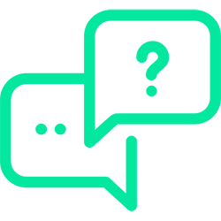

    

        
  

        
ONGOING SUPPORT

        

        

            

            

                
Design and consulting services for clients creating MoveIt!-enabled robotic applications

                

            

        

        

            

            

                
Ongoing integration and development support for your engineering team

                

            

        

        

            

            

                
Expert training and advice rooted in robotic theory

            

        

        

            

            

                
Cost-effective and reliable fixed-fee arrangement

            

        

    

    

        
WHAT HAPPENS WHEN YOU
             ENGAGE WITH US?

        

        

            

                
+ PLAN

                
We examine your robotic application and operation requirements, before proposing a customized solution. A full report accompanies the resulting integration recommendation.

            

            

                
+ INTEGRATE

                
We develop in house, or assist your engineers, in rolling out your MoveIt! and ROS-enabled system.

            

        

        

            

                
+ TRAIN

                
A vital element of the handover of your ROS packages concerns the transfer of detailed knowledge and documentation to your team on how build, test, and further customize as your robotic applications evolve.

            

            

                
+ SUPPORT

                
More than ever, having a team that can provide quick software support is crucial to avoiding project delays or blockers. PickNik guarantees support for those critical tasks.

            

        

        

            

                
+ UPGRADE

                
As your robotic application needs evolve, we collaborate closely with your team to improve your packages, taking advantages of open source contributions and academic research.

            

            

                
+ GIVE BACK

                
Any unused hours on your monthly support plan will be contributed to the open source maintenance and development of MoveIt! and related ROS packages.

            

        

    

    
    
GET IN TOUCH WITH US

    
Contact us and we will be more than happy to answer any questions you may have.

    <a href="{{site.baseurl}}/connect">
        
CONNECT

    </a>

